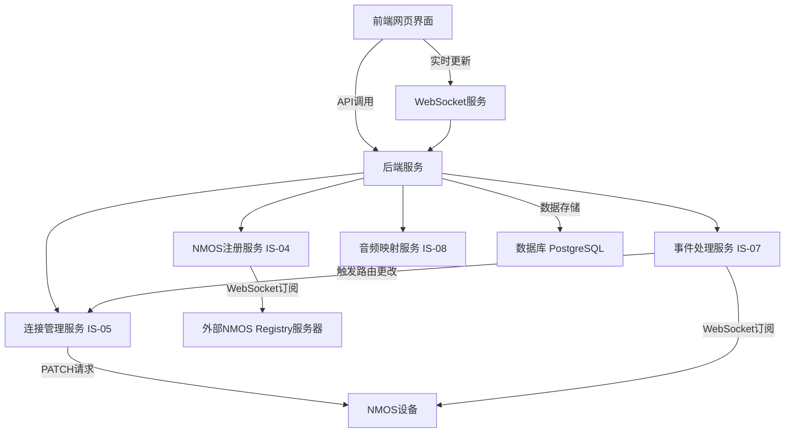

# 基于NMOS的广播电视系统控制软件架构设计

## 概述
本架构设计旨在创建一个支持NMOS IS-04、IS-05、IS-07和IS-08标准的广播电视系统控制软件，具有设备注册、路由控制和事件触发功能，并提供美观直观的网页界面。设计将基于现有代码结构，同时允许对现有服务进行重大调整或重构，以确保新功能与现有框架协调一致。

## 模块划分
系统架构分为以下主要模块：
1. **前端网页界面**：基于现有框架（React），提供直观的UI/UX，用于设备管理、路由控制和事件监控。
2. **后端服务**：
   - **NMOS注册服务（IS-04）**：负责与外部NMOS Registry服务器交互，处理设备注册和资源发现。
   - **连接管理服务（IS-05）**：实现路由控制，管理发送者和接收者之间的连接。
   - **事件处理服务（IS-07）**：订阅设备事件，根据规则引擎触发路由控制等操作。
   - **音频映射服务（IS-08）**：提供音频映射功能，支持音频通道的动态配置（基本框架，具体实现后续细化）。
3. **数据库**：存储设备信息、路由配置和事件规则，支持系统的高效运行。
4. **WebSocket服务**：用于实时通信，确保前端与后端之间的事件和状态更新。

## 技术选型
- **前端**：继续使用现有React框架，结合Redux进行状态管理，使用WebSocket进行实时更新。
- **后端**：基于Python的FastAPI框架，利用其高性能和异步支持，现有服务将进行优化和扩展。
- **数据库**：选择PostgreSQL，因为其强大的关系型数据库功能和对复杂查询的支持，适合存储设备和路由信息。
- **NMOS协议实现**：基于现有代码，使用`requests`和`websockets`库与NMOS设备和注册中心交互。

## 数据流和交互逻辑
1. **设备注册（IS-04）**：
   - 前端通过API调用后端NMOS注册服务，将设备信息发送至外部NMOS Registry服务器。
   - 后端通过WebSocket订阅注册中心的更新，实时同步设备列表至前端。
2. **路由控制（IS-05）**：
   - 用户通过前端界面选择源（Sender）和目的（Receiver），触发连接管理服务的API调用。
   - 后端向目标设备发送PATCH请求，更新路由配置，并将结果反馈至前端。
3. **事件触发（IS-07）**：
   - 事件处理服务订阅设备的事件源，接收到事件后通过规则引擎评估是否触发动作。
   - 若触发路由更改，则调用连接管理服务执行相应的路由操作。
4. **音频映射（IS-08）**：
   - 提供基本的API端点和数据结构，支持后续开发中的音频通道映射功能。

## 系统架构概览图

## 总结
此架构设计充分利用了现有代码结构，同时允许对服务进行重大调整以支持新功能。前端继续使用React框架，后端基于FastAPI进行优化，数据库选择PostgreSQL以满足系统需求。NMOS IS-04、IS-05、IS-07标准的功能已在现有服务中实现，并将在新设计中进一步完善；IS-08标准的基本框架已纳入设计，具体实现留待后续开发。