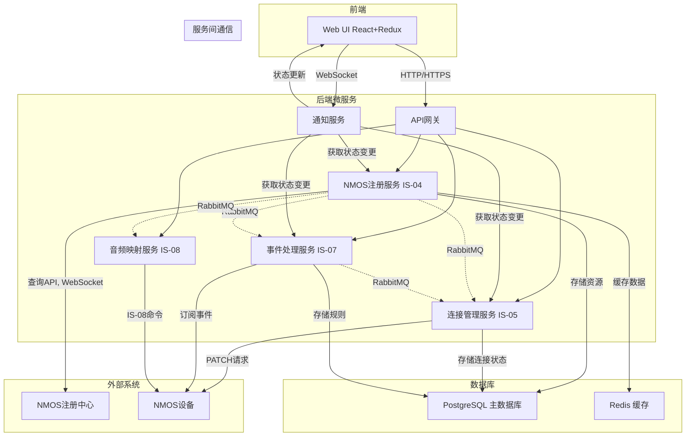

# “Roo Code” NMOS控制软件项目整体系统架构设计

基于您的需求和提供的开发计划，我为“Roo Code”项目设计了以下整体系统架构。此架构旨在实现NMOS标准的IS-04、IS-05、IS-07和IS-08功能，提供直观的用户界面，并确保系统的可扩展性和安全性。

## 1. 微服务模块划分及其职责

系统采用事件驱动的微服务架构，将功能划分为以下核心服务模块，每个模块负责特定的NMOS功能或系统任务：

### 1.1 后端服务模块

- **NMOS注册服务 (IS-04)**：
  - 负责与外部NMOS注册中心的交互，通过查询API进行设备发现，并通过WebSocket订阅获取实时更新。
  - 管理已发现的NMOS资源（Node、Device、Sender、Receiver、Source、Flow）的内部缓存和数据库。
  - 为其他服务提供访问NMOS资源清单的内部API。
- **连接管理服务 (IS-05)**：
  - 提供用于发起和管理连接的内部API。
  - 将路由请求转换为对设备Sender/Receiver的IS-05 PATCH请求，管理传输参数和激活模式（立即、延迟）。
  - 通过NMOS注册服务监控连接状态。
- **事件处理服务 (IS-07)**：
  - 管理对NMOS设备上IS-07事件源的订阅（通过WebSocket或MQTT）。
  - 处理传入的IS-07事件，并通过规则引擎将事件转换为路由变更等动作。
  - 与连接管理服务集成，实现事件触发路由功能。
- **音频映射服务 (IS-08)**：
  - 提供用于音频通道映射操作的内部API。
  - 将请求转换为对NMOS设备的IS-08命令，协调资源识别和连接管理。
- **API网关**：
  - 作为前端请求的单一入口点，将请求路由到相应后端服务。
  - 处理认证、授权和速率限制。
- **通知服务**：
  - 管理对Web UI的实时更新，通过WebSocket推送状态变更信息给客户端。

### 1.2 前端模块

前端基于 React 框架，采用模块化设计，包含以下主要组件：
- **仪表板**：提供系统状态概览和关键指标显示。
- **设备管理**：展示和管理通过 IS-04 发现的设备。
- **连接管理**：支持手动和批量 IS-05 连接操作。
- **事件监控**：配置和监控基于 IS-07 的事件触发路由。
- **音频映射**：执行基于 IS-08 的音频通道操作。
- **网络拓扑**：可视化设备和节点间的连接关系。

## 2. 模块间通信方式

- **异步消息传递**：服务间通信主要采用RabbitMQ作为消息队列，用于处理事件和命令的异步传递，增强系统的松耦合和弹性。
- **同步通信**：对于需要立即响应的请求，使用RESTful HTTP调用或gRPC，确保快速的数据交互。

## 3. 数据库设计

- **主要数据库 (PostgreSQL)**：用于存储结构化数据，包括NMOS资源清单、连接状态、用户配置和审计日志。数据库模式设计基于NMOS IS-04数据模型，包含以下关键表：
  - Node表：存储节点信息，包含id、label、href等字段。
  - Device表：存储设备信息，包含id、label、node_id等字段。
  - Sender和Receiver表：存储发送器和接收器信息，包含连接状态和传输参数。
  - Flow和Source表：存储流和源信息，维护层级关系。
  - 用户配置表：存储用户偏好和自定义路由配置。
- **缓存数据库 (Redis)**：用于存储频繁访问的数据、会话管理和轻量级消息代理，提升系统性能。

## 4. NMOS标准功能实现策略

- **IS-04 发现与注册**：通过DNS-SD发现注册中心，使用查询API获取资源列表，并通过WebSocket订阅实时更新，确保系统始终掌握网络中设备的最新状态。
- **IS-05 连接管理**：实现客户端逻辑，向Sender和Receiver发送PATCH请求，支持单播、组播和多种激活模式，确保路由控制的灵活性和可靠性。
- **IS-07 事件与Tally**：订阅事件源，解析事件消息，并通过规则引擎触发IS-05连接管理动作，实现动态工作流程自动化。
- **IS-08 音频通道映射**：通过IS-04发现支持IS-08的设备，使用IS-08 API进行通道映射操作，提供精细的音频控制。

## 5. 前后端交互机制

- **前端技术栈**：采用 React 框架，配合 React Router 进行页面导航，Redux 进行状态管理，Material-UI 提供界面组件，WebSocket 用于实时数据更新。
- **API交互层**：使用Axios或Fetch API与后端API网关通信，处理请求/响应格式化和错误处理。
- **实时更新**：通过WebSocket连接，由通知服务向前端推送设备状态、连接变更和事件信息，确保用户界面与系统状态同步。

## 6. 可扩展性和安全性考虑

- **可扩展性**：
  - 微服务架构允许独立扩展各个服务模块。
  - 使用IS-04查询API的分页和过滤功能处理大规模注册中心。
  - 采用数据库连接池和只读副本提升数据库性能。
- **安全性**：
  - 遵循AMWA BCP-003-01，使用TLS加密所有通信（HTTPS和WSS）。
  - 通过API网关实施认证和授权，采用基于角色的访问控制（RBAC）。
  - 对数据库中的敏感数据进行静态加密和访问控制。

- **后端技术栈**：基于 FastAPI 框架，使用 Pydantic 进行数据验证，Uvicorn 作为 ASGI 服务器，WebSocket 用于实时通信，Requests 用于 HTTP 请求。

## 架构图表

以下Mermaid图表展示了“Roo Code”系统的整体架构和模块间关系：

## 7. 需要改进的方面

基于代码审阅，以下是系统需要改进的一些关键方面：
- **前端**：
  - WebSocket 消息处理逻辑中消息类型硬编码，建议定义常量或枚举以提高可维护性。
  - 登录后数据初始化逻辑未完全实现，可能导致用户登录后看到不完整的数据。
- **后端**：
  - NMOS 注册服务中资源版本比较逻辑被注释，建议启用或优化以确保资源同步的准确性。
  - WebSocket 连接关闭后重连逻辑未完全实现，可能导致服务中断后无法自动恢复。
  - 日志记录中部分错误信息截断，可能影响故障诊断的效率。

## 总结

此系统架构设计基于微服务模式，充分利用 Python 作为后端开发语言，React 作为前端框架，并使用 RabbitMQ 进行服务间通信。它全面支持 NMOS 标准的 IS-04、IS-05、IS-07 和 IS-08 功能，通过清晰的模块划分和通信机制确保系统的灵活性和可维护性，同时注重可扩展性和安全性。