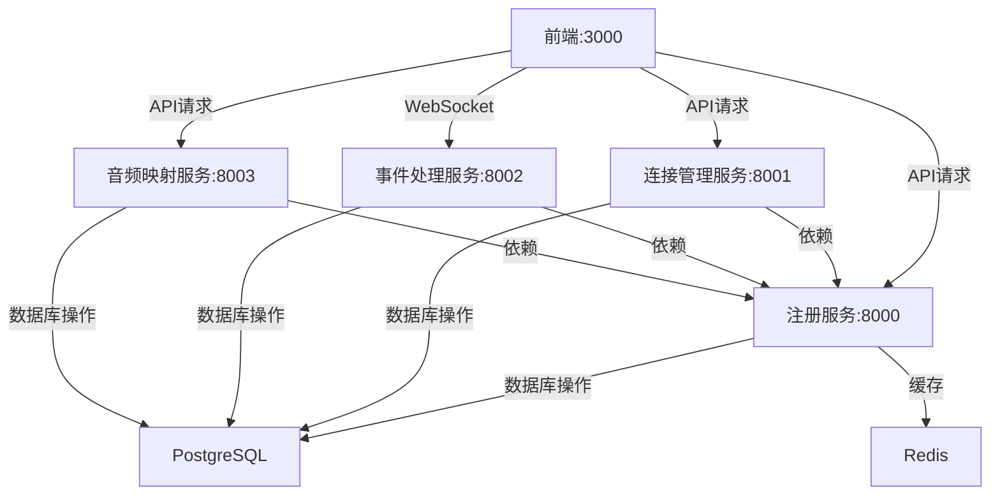

# NMOS路由控制软件架构与Docker Compose配置审查报告

## 1. 项目架构概述
根据对NMOS路由控制软件的审查，项目采用了微服务架构，主要分为以下几个部分：
- **前端**：基于React框架，提供用户界面，用于设备管理、连接控制和事件监控。
- **后端**：基于Python和FastAPI框架，分为多个服务，包括注册服务、连接管理服务、事件处理服务和音频映射服务。
- **数据库**：计划使用PostgreSQL作为主要数据库存储NMOS资源和连接状态，使用Redis作为缓存数据库。

## 2. Docker Compose配置分析
当前的[`docker-compose.yml`](docker-compose.yml)文件定义了以下服务：
- `registry_service`：NMOS注册服务，端口8000。
- `connection_service`：连接管理服务，端口8001，依赖于注册服务。
- `event_service`：事件处理服务，端口8002，依赖于注册服务。
- `audio_mapping_service`：音频映射服务，端口8003，依赖于注册服务。
- `frontend`：前端服务，端口3000，依赖于所有后端服务。

**优点**：
- 服务之间通过`depends_on`明确定义了依赖关系。
- 使用了自定义网络`nmos-network`，确保服务间通信隔离。
- 环境变量配置清晰，方便调整服务行为。

**缺点**：
- 缺少数据库服务（PostgreSQL和Redis）的配置，这将导致在全新环境中无法完整部署。
- 前端`Dockerfile`中的环境变量指向不准确，指向了`backend:8000`，而实际应指向多个服务的具体地址。
- 后端服务的`Dockerfile`启动命令针对特定服务，而`docker-compose.yml`中通过`command`覆盖，可能导致配置不一致。
- 没有定义持久化卷用于存储数据库数据，可能导致容器重启后数据丢失。

## 3. 改进建议
为了确保在全新电脑上可以通过Docker Compose完全部署此程序，我提出以下改进建议：
1. **添加数据库服务**：
   - 在`docker-compose.yml`中添加PostgreSQL和Redis服务。
   - 为数据库配置持久化卷，确保数据不会因容器重启而丢失。
   - 配置初始化脚本，确保数据库表结构在启动时自动创建。
2. **调整前端环境变量**：
   - 更新前端`Dockerfile`或`docker-compose.yml`中的环境变量，确保正确指向各个后端服务的地址。
3. **统一后端服务启动命令**：
   - 修改后端`Dockerfile`中的启动命令为通用命令，通过`docker-compose.yml`中的`command`参数指定具体服务。
4. **添加健康检查**：
   - 为每个服务添加健康检查，确保服务启动后能够正常工作。
5. **文档完善**：
   - 在`README.md`或部署指南中详细说明Docker Compose的部署步骤和可能需要的环境配置。

## 4. 服务关系图
以下Mermaid图表展示了改进后的服务关系和依赖：

## 5. 实施计划
- **步骤1**：在`docker-compose.yml`中添加PostgreSQL和Redis服务配置，包括持久化卷和初始化脚本。
- **步骤2**：更新前端服务的环境变量配置，确保正确指向各个后端服务。
- **步骤3**：调整后端`Dockerfile`和`docker-compose.yml`中的启动命令，确保一致性。
- **步骤4**：为每个服务添加健康检查配置。
- **步骤5**：更新项目文档，详细说明Docker Compose部署步骤。