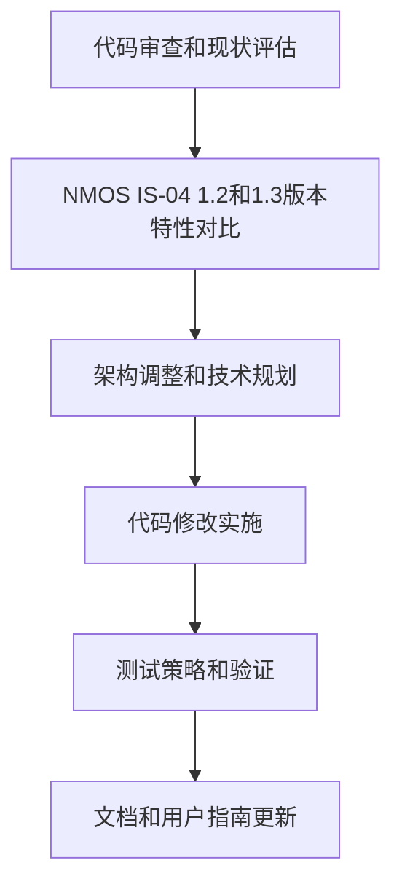

# 支持NMOS IS-04 1.2及1.3版本的计划

为了确保NMOS控制器项目兼容NMOS IS-04 1.2和1.3版本，制定了以下详细计划。这个计划分为几个关键阶段，涵盖代码审查、特性对比、修改实施和测试策略。

## 计划阶段和步骤

1. **代码审查和现状评估**
   - 目标：全面审查当前代码库，确定对NMOS IS-04 1.2和1.3版本的支持程度。
   - 步骤：
     - 审查`roo-code/backend/nmos_registry_service/main.py`文件，分析当前实现的IS-04功能。
     - 检查其他相关文件，如`roo-code/backend/connection_management_service/main.py`，了解与IS-04相关的交互。
     - 搜索项目文档和代码注释，收集关于当前支持版本的任何信息。
   - 预计成果：一份详细的报告，说明当前代码支持的功能和存在的差距。

2. **NMOS IS-04 1.2和1.3版本特性对比**
   - 目标：识别1.2和1.3版本之间的差异以及对代码的影响。
   - 步骤：
     - 参考AMWA官方文档（[IS-04规范](https://specs.amwa.tv/is-04/)），对比1.2和1.3版本的API、数据模型和行为要求。
     - 重点关注版本更新可能影响的领域，如资源版本控制、查询API功能和WebSocket订阅机制。
   - 预计成果：一份特性差异清单，标注需要代码调整的领域。

3. **架构调整和技术规划**
   - 目标：设计支持两个版本的架构方案。
   - 步骤：
     - 确定是否需要版本特定的代码路径或配置选项来处理1.2和1.3版本的差异。
     - 规划如何在后端服务中实现版本检测和兼容性逻辑。
     - 考虑前端界面的调整，确保用户可以查看和选择与不同版本设备交互的方式。
   - 预计成果：架构设计文档，描述支持多版本IS-04的实现方案。

4. **代码修改实施**
   - 目标：根据规划调整代码，确保兼容性。
   - 步骤：
     - 更新`roo-code/backend/nmos_registry_service/main.py`文件，添加对1.2和1.3版本的支持逻辑。
     - 修改相关服务模块，确保与不同版本的IS-04资源正确交互。
     - 调整前端代码（如`roo-code/frontend/src/api.js`），以处理可能的不同API响应格式。
   - 预计成果：更新后的代码库，支持NMOS IS-04 1.2和1.3版本。

5. **测试策略和验证**
   - 目标：验证代码对两个版本的兼容性。
   - 步骤：
     - 制定测试计划，包括单元测试、集成测试和系统测试。
     - 使用模拟NMOS设备（如AMWA nmos-device-control-mock）测试不同版本的交互。
     - 在真实环境中测试，确保与支持1.2和1.3版本的注册中心和设备正确通信。
   - 预计成果：测试报告，确认代码在各种场景下的兼容性。

6. **文档和用户指南更新**
   - 目标：更新项目文档，反映对新版本的支持。
   - 步骤：
     - 更新`roo-code/USER_GUIDE.md`和`roo-code/PROJECT_REVIEW.md`，说明支持的IS-04版本和使用说明。
     - 提供版本兼容性相关的配置指南，帮助用户设置与不同版本设备交互的环境。
   - 预计成果：更新后的文档，确保用户了解系统对NMOS IS-04 1.2和1.3版本的支持。

## Mermaid流程图

以下Mermaid图表展示了计划的各个阶段和依赖关系：

## 时间表和优先级

- **代码审查和现状评估**：1周，优先级高，立即开始。
- **特性对比**：1周，与审查并行进行。
- **架构调整和技术规划**：2周，在审查和对比完成后开始。
- **代码修改实施**：3周，在架构规划完成后进行。
- **测试策略和验证**：2周，在代码修改完成后进行。
- **文档和用户指南更新**：1周，与测试并行进行。

总预计时间：6-8周，取决于并行任务的执行情况。